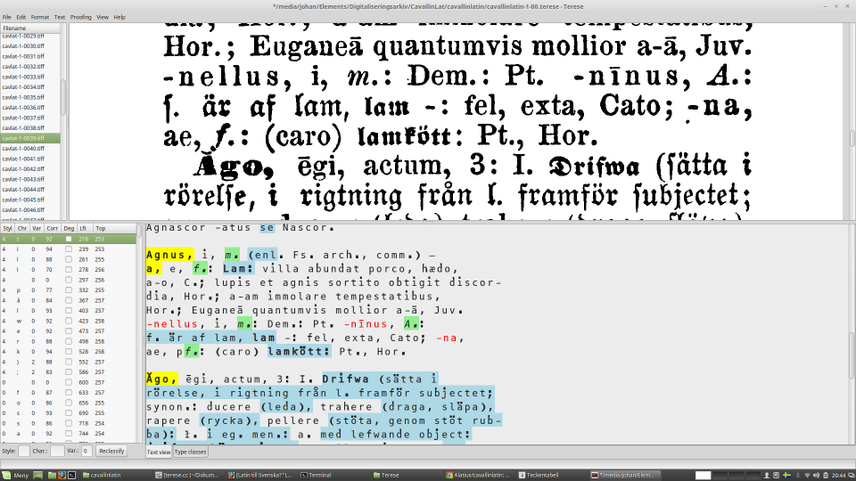
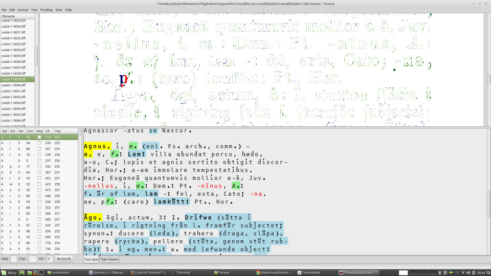

# Latinskt lexicon

This the repository for the digitizing the Latin-Swedish Lexicon by Christian Cavallin, specifically the proofreading of the OCR text. The project is initiated and administrated by Johan Winge (Alatius), johan.winge@gmail.com, who should be contacted if you have questions. The rest of this information is in Swedish, but anyone is invited to participate.

Hela boken (”Latinskt lexicon, till läroverkens tjenst, i etymologisk uppställning utarbetadt af Christian Cavallin.”) är inskannad från ett exemplar från den reviderade upplagan tryckt 1873. Titelsida, förord, och förkortningslista återfinns här under `frontmatter`. Den egentliga ordbokstexten är uppdelad i en bildfil per kolumn, och återfinns under `columns`.

För OCR-tolkningen har programmet Tesseract tränats enkom för denna bok, och resultatet har även efterbearbets på automatisk väg med specialutvecklad mjukvara. Därigenom är texten redan av relativt god kvalitet, även innan korrekturläsning, och med full uppmärkning av de olika teckensnitt som används i boken. Men för att få till en användbar och tillförlitlig digital utgåva måste texten granskas; därav detta projekt.

Den digitala texten är lagrad i filerna `cavallinlatin-X-XX.terese`: varje sådan fil rymmer text för upp till 100 kolumner. Dessa filer är i XML-format, och kan i princip redigeras i valfri texteditor. De är dock avsedda att korrekturläsas med hjälp av det specialskrivna programmet Terese, som återfinns under `terese`.

För att köra Terese rekommenderas starkt att Linux används. Har man inte tillgång till en linuxdator kan man relativt lätt installera Linux på en virtuell maskin som körs under Windows, t.ex. med programmet VirtualBox.

Se http://terese.sourceforge.net/ för en ingående beskrivning av en äldre version av Terese.

## Volontera som korrekturläsare

Du är varmt välkommen att hjälpa till med korrekturläsningen! Själva korrandet är inte alls svårt, men kräver en del förberedelser. Följande beskriver förfarandet översiktligt. Jag hjälper gärna till med allt detta, t.ex. över Skype.

1. Skapa ett konto här på GitHub, om du inte har det redan.
2. Installera Linux om du inte har det, t.ex. Ubuntu eller Linux Mint.
3. Under Linux, logga in på GitHub, och ladda ner detta projekt med `git clone https://github.com/Alatius/cavallinlatin.git`.
4. Kompilera Terese, enligt anvisningarna i filen `terese/README`.
5. Installera fonten `DPCustomMono2.ttf` (valfritt).
6. Välj en oreserverad terese-fil att jobba med (se nedan), och meddela mig på johan.winge@gmail.com vilken fil du har valt, samt ditt användarnamn på GitHub, så jag kan lägga till dig som användare med skrivrättigheter.

Följande procedur rekommenderas vid korrekturläsandet:

1. Starta Terese med kommandot `src/terese`, och öppna den fil du valt.
2. Läs igenom den kolumn du är på och rätta felaktiga tecken och uppmärkningar (fet, fraktur, kursiv, spärrad stil) som du upptäcker. Det är inte nödvändigt att slaviskt jämföra varje ord med bilden i detta skede, utan jag brukar helt enkelt läsa igenom texten, och konsultera bilden endast vid tveksamheter. Var särskilt vaksam på `n` och `u`. Svagt tryck gör ofta att `;` ser ut som och tolkats som `:`.
3. När du har gått igenom hela kolumnen, tryck `F5` för att börja grafiskt jämföra din text med den inskannade bilden. Det första tecknet kommer att placeras ut, och dyka upp i listan nere till vänster i fönstret. Välj det, och håll nere `ctrl` och dubbelklicka på dess rätta plats i bilden för att flytta det. Tryck sedan `F5` igen.
4. Korrigera eventuella återstående skillnader mellan den digitala texten och bilden som du kan upptäcka. Du kan behöva göra detta iterativt, och trycka `F5` flera gånger, och eventuellt även flytta tecken en aning med `ctrl` + dubbelklick, om Terese tappar bort sig.
5. När du är nöjd, välj nästa bild i listan uppe till vänster. Det kan vara en god idé att ha för vana att spara filen nu. Gå till steg 2.
6. När du är klar med hela filen (och gärna även med jämna mellanrum dessförinnan, t.ex. en gång i veckan), ladda upp dina ändringar till GitHub:
`git add cavallinlatin-X-XX.terese`,
`git commit -m "Kolumn X-XXXX klar"`,
`git push`

Diverse detaljer att ha i åtanke:

* Ta bort kolumnnummer och kolumnrubriker.
* Indrag i ordboken betecknas med tomrad i OCR-texten. Lämna därför en tom första rad i texten om första raden i kolumnen är indragen.
* Terese har ingen ångrafunktion. Ha därför för vana att spara filen med jämna mellanrum.
* Texten innehåller en del tecken som kan vara besvärliga att skriva med tangentbordet. De vanligaste är: `āēīōūȳ ăĕĭŏŭỳ ā̆ē̆ī̆ō̆ū̆ȳ̆ ĀĒĪŌŪȲ ĂĔĬŎŬỲ Ā̆Ē̆Ī̆Ō̆Ū̆Ȳ̆ æſßɔ —⏑`. Därtill kommer naturligtvis alla grekiska tecken...
* Av historisk och teknisk anledning använder jag `ỳ` och `Ỳ` istället för `y̆` och `Y̆`.
* Tecknet `ſ` (långt s) visas som identiskt med `s` i detta projekts version av DPCustomMono2, för att underlätta korrekturläsningen.
* Ibland är det uppenbara feltryck i ordboken, med enskilda tecken som blivit fel, t.ex. upp-och-nedvända bokstäver, bokstäver från fel teckensnitt, eller tecken som fallit bort. Rätta i så fall i OCR-texten; det är bättre att vår digitala text är korrekt, än att vi återskapar uppenbara fel i den gamla boken. Men, ändra _inte_ t.ex. stavningen, och skriv inte heller om texten. Ifall du hittar uppenbara felaktiga ord eller uppgifter, låt det stå som det är, men gör en anteckning någonstans, så kan vi ta itu med det när det är dags att publicera texten. 

Dessa instruktioner kan med största sannolikhet komma att utökas och förtydligas framöver.

## Reserverade filer

Detta är nuvarande status för de olika textfilerna. Frånvaron av namn eller kommentar betyder att filen är ledig och redo att korrekturläsas av vemhelst som känner sig hågad.

- [x] cavallinlatin-1-00.terese Alatius
- [x] cavallinlatin-1-01.terese Alatius
- [x] cavallinlatin-1-02.terese Alatius
- [ ] cavallinlatin-1-03.terese Alatius, grovrättad
- [ ] cavallinlatin-1-04.terese Alatius, grovrättad
- [ ] cavallinlatin-1-05.terese Alatius, grovrättad
- [ ] cavallinlatin-1-06.terese Alatius, grovrättad
- [ ] cavallinlatin-1-07.terese Alatius, grovrättad
- [ ] cavallinlatin-1-08.terese Alatius, grovrättad
- [ ] cavallinlatin-1-09.terese Alatius, grovrättad
- [ ] cavallinlatin-1-10.terese Alatius, grovrättad
- [ ] cavallinlatin-1-11.terese Alatius, grovrättad
- [ ] cavallinlatin-2-00.terese Alatius, grovrättad
- [ ] cavallinlatin-2-01.terese Alatius, grovrättad
- [ ] cavallinlatin-2-02.terese Alatius, grovrättad
- [ ] cavallinlatin-2-03.terese Alatius
- [ ] cavallinlatin-2-04.terese
- [ ] cavallinlatin-2-05.terese
- [ ] cavallinlatin-2-06.terese
- [ ] cavallinlatin-2-07.terese
- [ ] cavallinlatin-2-08.terese
- [ ] cavallinlatin-2-09.terese
- [ ] cavallinlatin-2-10.terese
- [ ] cavallinlatin-2-11.terese
- [ ] cavallinlatin-2-12.terese
- [ ] cavallinlatin-2-13.terese
- [ ] cavallinlatin-2-14.terese

